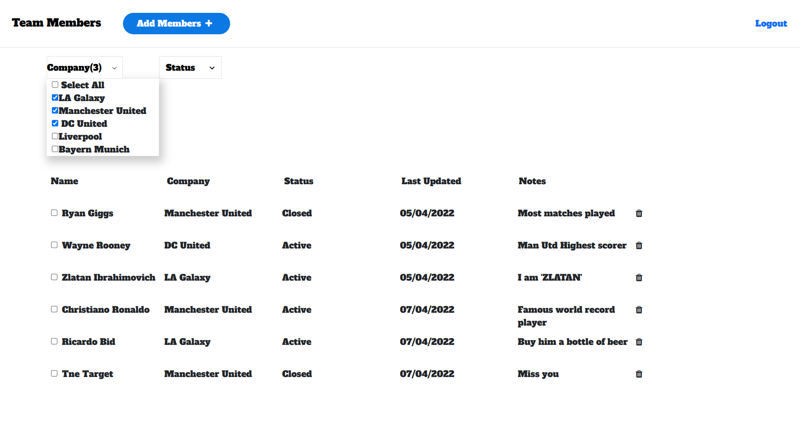

# team-members

A simple application built using React.js and Redux.

## Table of contents

- [Overview](#overview)
  - [Features](#features)
  - [Screenshot](#screenshot)
  - [Links](#links)
- [My process](#my-process)
  - [Built with](#built-with)
- [Author](#author)

## Overview

### Features

Users are able to:

- Register an account and login
- See a list of soccer team members on the home page
- Add and delete team members
- Sort team members by status
- Filter team members according to company

### Screenshot

### Links

- Solution URL: [https://github.com/Bluette1/team-members](https://github.com/Bluette1/team-members)
- Live Site URL: [Team members app on heroku](https://team-members-app.herokuapp.com/login)

## My process

### Built with

- React
- Redux
- Bootstrap
- HTML5
- CSS 

## Author

- Website - [Marylene Sawyer](http://www.marylene.tech/)
- GitHub - [@Bluette1](https://github.com/Bluette1)
- Twitter - [@MaryleneSawyer](https://twitter.com/MaryleneSawyer)

